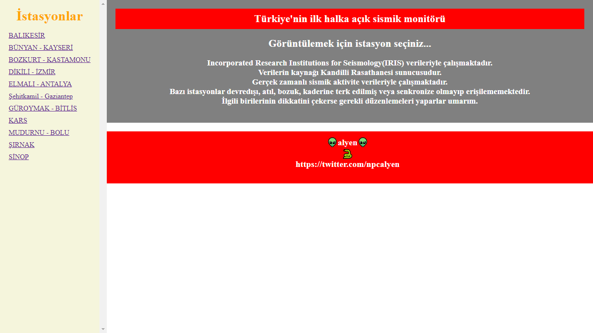
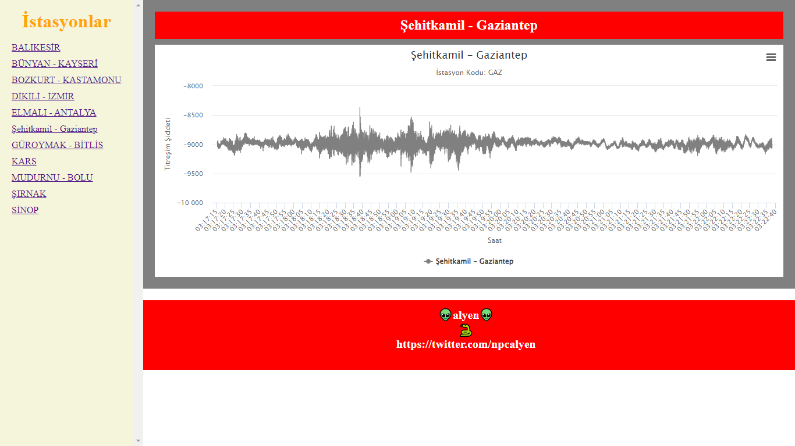

# Sismograf

Türkiye'nin ilk ve tek halka açık sismik aktivite monitörünün gerçek zamanlı olanı.

## Açıklama 🕯️

Verilerin kaynağı doğrudan IRIS'dir.
Sunucu ağı Kandilli Rasathanesidir
Incorporated Research Institutions for Seismology (IRIS) verileriyle çalışmaktadır. 11 adet gerçek zamanlı istasyonun verilerini grafik olarak sismograf şeklinde görüntülenmesi amaçlanmıştır. Türünün tek örneği olup, Dünya'da dahil herhangi bir ülkeden bir kişi çıkıp benzer bir uygulama yapmamıştır. 

```
## Kullanım 🚀
localhost'da geliştirilmiş ve test edilmiştir.

~ Malzemeler 🤖
* Python 🐍
* Flask
* Obspy

```

##


## Yapan-eden

👽 [Alyen](https://twitter.com/npcalyen) 🐍

## 